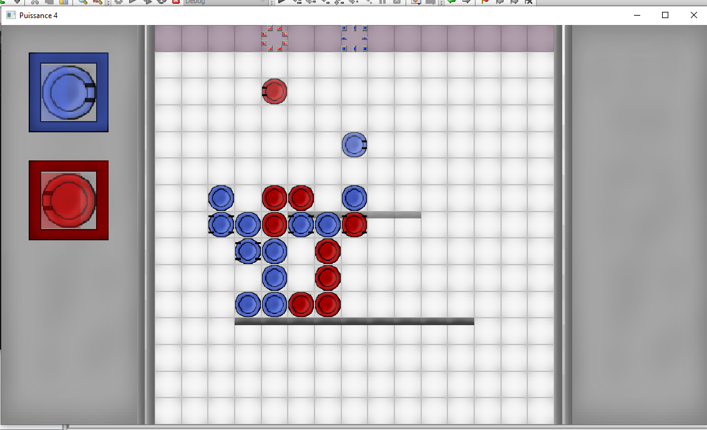
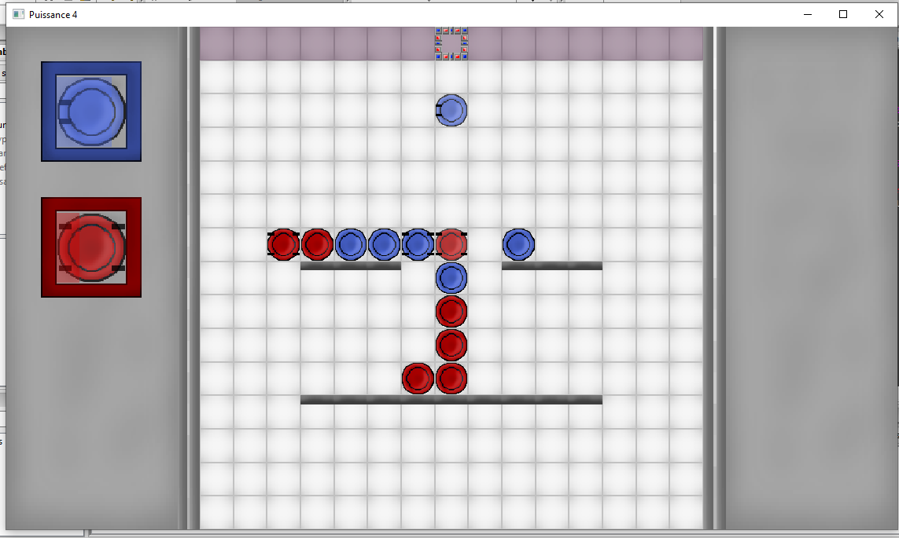
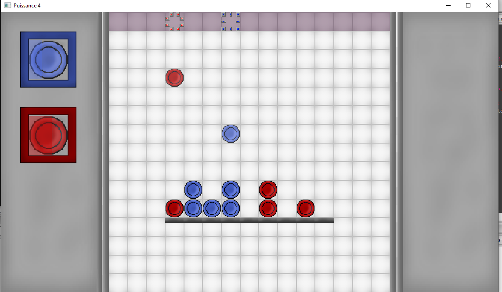
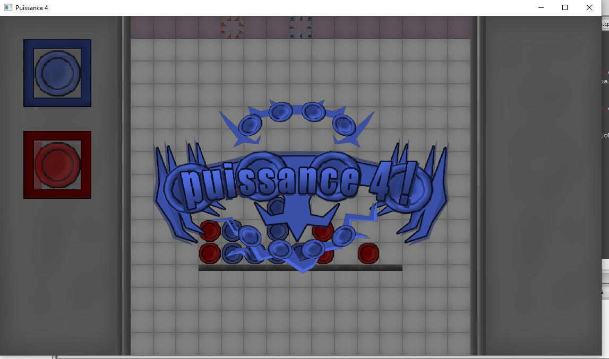

# Puissance 4
Real time Connect4, with 2 players and special move and many fields.

## Controls
### Player 1
Move Cursor Up: UP
Move Cursor Down: DOWN
Move Cursor Left: LEFT
Move Cursor Right: RIGHT

Next Move Category: P
Previous Move Category: O

Next Move: M
Previous Move: L

Summon Coin: SPACE

Special Key: I
### Player 2
Move Cursor Up: NUMPAD8
Move Cursor Down: NUMPAD2
Move Cursor Left: NUMPAD4
Move Cursor Right: NUMPAD6

Next Move Category: +
Previous Move Category: -

Next Move: NUMPAD9
Previous Move: NUMPAD7

Summon Coin: NUMPAD5

Special Key: NUMPAD0

## Special Move
By switching move you can select, sliding coin or grabing coin.
The Special Key, when pressed make the coins land on transparent platform and double grab grab to something around.

## Compilator Used
GCC 7.3.0 32bit DW2

## Library
SFML 2.5.1 32 bit dw2